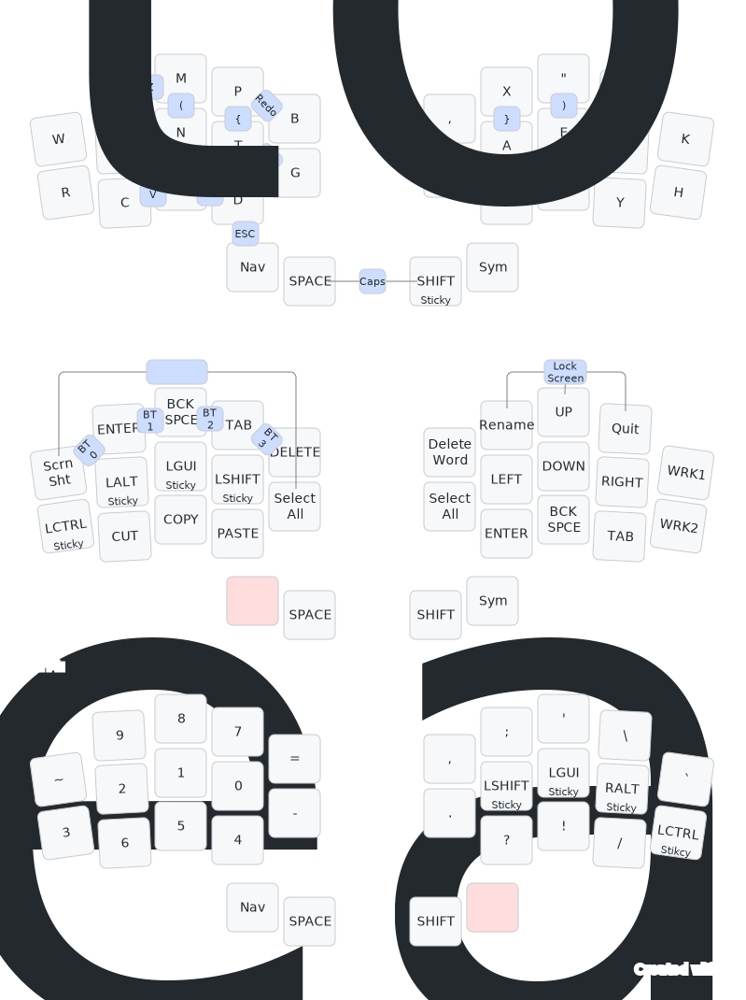

# zmk-config

This is my personal [ZMK firmware][1] configuration for my current 30-key wireless keyboards [Battoota](https://github.com/AlaaSaadAbdo/battoota).

I use this keyboard for both windows and mac, to type in Arabic and English

## Layout

 

## References

* [dxmh zmk config](https://github.com/dxmh/zmk-config)
* [jcmkk3 zmk config](https://github.com/jcmkk3/zmk-config)
* [Callum's layout](https://github.com/callum-oakley/keymap)

## Links

[Low Profile Keyboards discord](https://discord.gg/69UM9sQF8q). I got a lot of help there.

[1]: https://github.com/zmkfirmware/zmk
