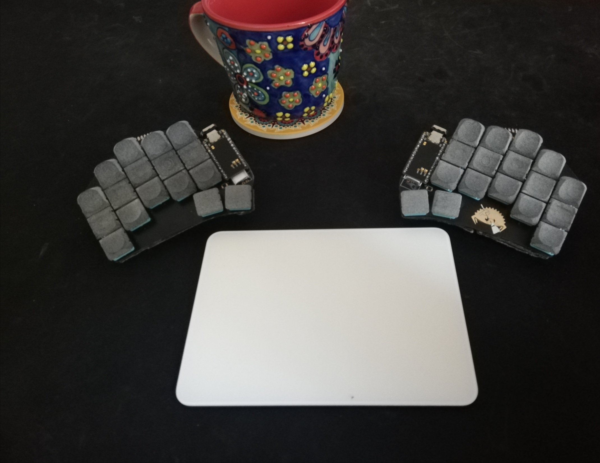
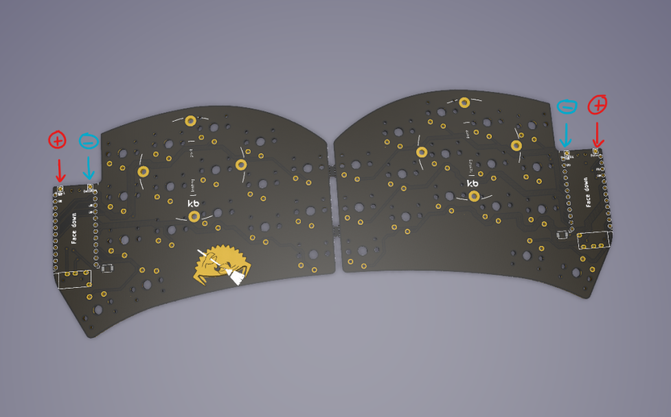

# zmk-config

This is my personal [ZMK firmware][1] configuration for my current 34-key wireless keyboards [Sweep][2].

I use this keyboard for both windows and mac, to type in Arabic and English

 

## Layout

 

## Parts

To build and use a similar one you will need:

* 1x PCB Kit [Sweep v2.1](https://github.com/davidphilipbarr/Sweep/tree/main/Sweepv2.1) can be manufactured by sending the `gerber.zip` in the link to a pcb manufacturer e.g. [jlcpcb](https://jlcpcb.com/)
* 2x promicro compatible boards or 2 [nice!nanos](https://splitkb.com/products/nice-nano). Get the sockets and diode legs to socket your controller.
* 34 switches of a compatible type (refer to the compatibility table) e.g. Kailh Low Profile Choc Switches
* 34 keycaps
* 2x power switches. (they come in the expansion bundle in the nice!nano link)
* 2x batteries. e.g. 301230 Polymer Lithium Ion Battery

## Assembly

The video above shows the wired version. The difference for the wireless is that the battery needs to be soldered on the pcb in the following position:

## Firmware

Firmware for zmk and bluemicro_ble is called ["Cradio"](https://zmk.dev/docs/hardware/).

## References

* [dxmh zmk config](https://github.com/dxmh/zmk-config)
* [jcmkk3 zmk config](https://github.com/jcmkk3/zmk-config)
* [Callum's layout](https://github.com/callum-oakley/keymap)

## Links

[Low Profile Keyboards discod](https://discord.gg/69UM9sQF8q). I got a lot of help there.

[1]: https://github.com/zmkfirmware/zmk
[2]: https://github.com/davidphilipbarr/Sweep
